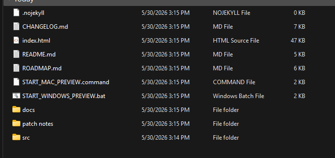

# Repo Organization

This repo keeps the app surface and documentation surface separate.

The goal is simple:

- Keep the repo root clean.
- Keep the running app easy to find.
- Keep docs grouped by purpose.
- Keep patch notes out of the main docs flow but easy to browse.
- Avoid scattered Markdown files at the root.

---

## Before cleanup

The prior documentation pass improved the content, but the repo root still mixed app files, documentation files, scripts, docs, patch notes, and source folders at the same level.



---

## Current root layout

```text
MoneyMap/
  .nojekyll
  README.md
  index.html
  src/
  docs/
  patch-notes/
  tools/
```

---

## Folder responsibilities

| Folder | Responsibility |
|---|---|
| `src/` | Application source files. This documentation cleanup does not modify app source. |
| `docs/` | Product, usage, audit, roadmap, and repo maintenance docs. |
| `patch-notes/` | Version-specific Markdown release notes. |
| `tools/` | Optional helper scripts that support local preview or repo workflow. |

---

## Docs structure

```text
docs/
  README.md
  01-product/
    overview.md
    features.md
    current-limitations.md
  02-usage/
    local-preview.md
    privacy-and-data.md
    csv-import.md
  03-audit-and-roadmap/
    product-audit.md
    roadmap.md
  04-release-history/
    changelog.md
  05-repo/
    organization.md
    assets/
      repo-root-before.png
```

---

## Patch notes structure

```text
patch-notes/
  README.md
  releases/
    v0.1.12.md
    v0.1.11.md
    v0.1.10.md
    v0.1.9.md
    v0.1.8.md
    v0.1.7-legacy-mismatch.md
    v0.1.6.md
    v0.1.5.md
    v0.1.4.md
```

---

## Naming rules used here

- Folder names use lowercase kebab-case for cleaner URLs.
- Documentation folders are numbered so they sort in reading order.
- Release notes live in one dedicated `patch-notes/` area.
- Root-level Markdown is limited to `README.md`.
